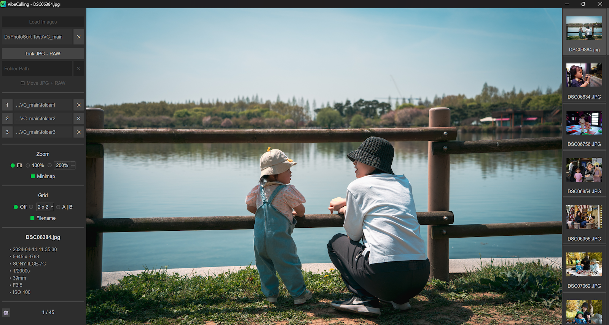

[English](README.md) | [한국어](README.ko.md)

# VibeCulling

## 이 프로그램은?
*   아마추어 사진가를 위한 간단한 사진 셀렉 툴입니다.
*   WASD, 숫자 키, 스페이스바를 사용하여 게임하듯이 한 손으로 사진을 셀렉할 수 있습니다.
*   JPG와 RAW 파일을 함께 처리합니다.
*   카메라 메모리 카드에서 PC로 수백 장의 사진을 전송한 직후, 실제로 남길 수십 장을 빠르게 선별하는 초기 셀렉 단계에 특히 유용합니다.
*   오픈소스, 포터블(설치 불필요), 100% 로컬(인터넷 연결 불필요).

## 오해하지 마세요
*   별점이나 플래그로 작업하는 툴이 아닙니다.
*   이미지를 편집하지 않습니다. 삭제하지도 않습니다. EXIF 데이터를 편집하지도 않습니다. 지정한 폴더로 이동만 시킵니다.
*   아주 빠르지는 않습니다. 특히 RAW 파일을 디코딩하여 보는 경우에(그래서 RAW 파일의 내장 미리보기 이미지 사용을 권장합니다).
*   **멀웨어/바이러스가 아닙니다.** 이 프로그램은 코드 서명이 되어 있지 않아서(쉽게 말해 MS나 애플에 비용을 지불하지 않아서), 윈도우 또는 맥OS에서 수상한 앱으로 오탐지 될 수 있습니다. 하지만 멀웨어가 아니며 전체 소스 코드가 공개되어 있습니다. VirusTotal 스캔 결과도 확인할 수 있습니다: https://www.virustotal.com/gui/file/aa34c708b58d1b5f0d7662fe8f73db3de01a40a2cf816831fcd74dfff50396b7?nocache=1

## 제작 동기
*   저는 아마추어 아빠 사진사로서 사진 찍는 것을 좋아하고, 마음에 드는 사진을 보정하는 것도 좋아합니다. 하지만 셀렉 과정은 재미 없고 귀찮기만 했습니다. 그 과정이 싫어서 셔터를 아껴 누르거나 연사를 피하는 경우도 있었습니다.
*   저도 RAW 파일 보정할 땐 라이트룸을 사용하지만, 셀렉용으로는 제 노트북에서 너무 무겁습니다.
*   저는 매우 간단한 프로그램이 필요했고 전문가용 유료 소프트웨어에 돈을 쓰고 싶지 않았습니다. 무료이면서 단순한 셀렉 프로그램을 찾아봤지만 저에게 딱 맞는 것을 찾을 수 없어서, AI의 도움을 받아 이 프로그램을 만들었습니다.

## 참고사항
1.  **최소 사양(추정치):** 1920x1080 해상도, 8GB RAM, 대략 듀얼코어 또는 쿼드코어 CPU
2.  이 프로그램은 원래 "PhotoSort"(https://github.com/newboon/PhotoSort)라는 이름으로, 한국 카메라 커뮤니티의 몇몇 유저들과 함께 사용해보며 피드백을 받고 업데이트를 하고 있었습니다. 후에 다른 프로그램이 이미 같은 이름을 사용하고 있다는 것을 알게 되었고, 또 조금 재미 없다는 생각이 들었습니다. 그래서 누락된 필수 기능들을 추가하고 VibeCulling이라는 새 이름으로 다시 올렸습니다.
3.  RAW로만 촬영하는 사용자에게는 파일을 로드할 때 "미리보기" 옵션 사용을 강력히 권장합니다. 훨씬 빠르고 호환성 문제를 피할 수 있습니다. 기본 라이브러리의 한계로 인해 일부 카메라의 RAW 파일—Nikon(Z8, Z9), Canon(R5 Mark II), Panasonic(S1R, S5) 등—은 디코딩에 실패하거나 색상이 왜곡되어 표시될 수 있습니다. 하지만 니콘과 캐논의 경우 내장 미리보기 이미지의 해상도가 충분히 높아서 실질적으로 셀렉하는 데 문제는 없습니다. 아쉽게도 파나소닉의 미리보기 이미지는 더 작아서 낮은 해상도로 작업해야 합니다. 또한 후지필름 카메라의 RAW 파일은 디코딩이 유독 오래 걸리는 것으로 확인되었습니다(아마도 X-Trans 센서의 독자적인 배열 때문인 듯).
4.  프로그램이 현재 상태에서 크게 변경될 가능성은 낮을 것 같습니다. 셀렉 툴이 가져야 할 기본 기능들을 이제 갖추었다고 생각합니다. 더 중요한 것은 코드베이스가 커지면서 저와 AI 모두에게 큼직한 새 기능을 추가하는 것이 어려워졌다는 점입니다. 하지만 버그를 제보하신다면 최선을 다해 수정하겠습니다.
5.  이 프로젝트는 오픈소스이며, 누구든지 개선할 수 있습니다. 하지만 제가 깃허브 사용법에 익숙하지 않아서, 프로젝트를 포크해서 별도로 진행하는 것이 편하실 겁니다.
6.  제가 접근할 수 있는 PC는 Windows 노트북뿐입니다. 이 프로그램을 다양한 시스템 사양과 해상도에 대응되도록 만들려고 노력했지만 성능적으로, 디자인적으로 최적화가 미흡한 부분이 있을 수 있습니다.
7.  이 프로그램은 캐싱(백그라운드 로딩)을 광범위하게 사용하므로, 특히 고해상도 사진으로 작업하는 경우 시스템 메모리를 많이 차지할 수 있습니다.

---

## 사용 방법

### 1. 사진 폴더 불러오기

  

### 2. 분류 폴더 지정

  

### 3. 한손 셀렉 예시 (왼손)

  

### 4. 한손 셀렉 예시 (오른손)

  

### 5. 확대 기능

  

### 6. 비교 기능

  

---

## 시작하기

**[GitHub Release 페이지](https://github.com/newboon/VibeCulling/releases)**에서 Windows 및 macOS용 최신 버전을 다운로드할 수 있습니다.

-   **Windows:** `VibeCulling_vX.X.X_win.zip` 파일을 다운로드하세요.
-   zip 파일을 압축 해제하세요
-   `VibeCulling.exe`를 실행하세요 (설치 불필요)
-   **macOS:** `VibeCulling_vX.X.X_macOS.dmg.zip` 파일을 다운로드하세요.

---

## 라이선스

이 프로젝트는 GNU Affero General Public License Version 3 (AGPL-3.0) 의 적용을 받습니다.
이는 소프트웨어를 자유롭게 사용, 수정, 배포할 수 있지만, 네트워크 서비스 제공에 사용되는 경우를 포함하여 모든 수정사항은 동일한 라이선스 하에 제공되어야 함을 의미합니다.
자세한 내용은 LICENSE 파일을 참조하세요.