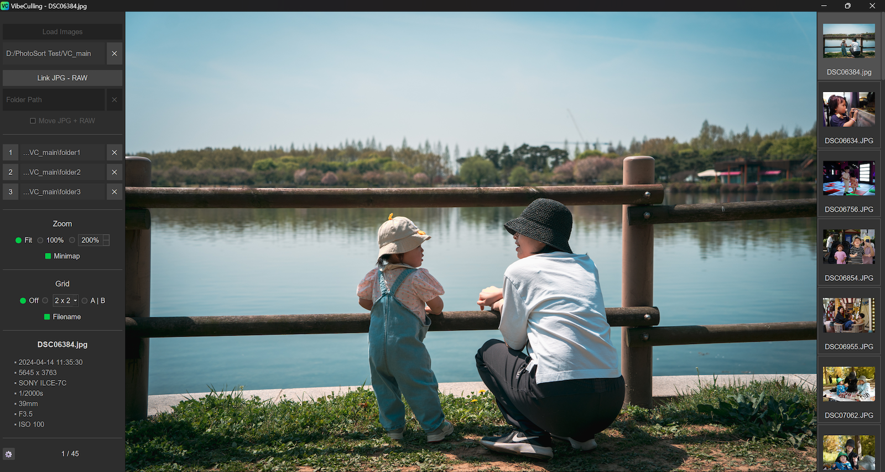

[English](README.md) | [한국어](README.ko.md)

# VibeCulling



## What it is
*   A simple culling tool for amateur photographers that works by moving photos into folders.
*   Cull your photos single-handedly, almost like playing a game, using WASD, number keys, and the spacebar.
*   Handles both JPG and RAW files together.
*   It's especially useful for the initial culling stage—right after transferring hundreds of photos from your camera's memory card to your PC, helping you quickly select the few dozen shots worth keeping.
*   Open-source, portable (no installation required), and 100% local (no internet connection needed).

## What it isn't
*   This is not a tool that works with ratings or flags.
*   It does not edit your images. It does not delete them. It does not edit EXIF data. It only moves them to the folders you specify.
*   Honestly, it's not super fast. This is particularly true when decoding RAW files to view them (which is why I recommend using the embedded preview images in RAW files). I've tried my best to make it as fast as possible, but this is the limit of my coding skills.
*   **This is not malware.** While this application is not code-signed (I haven't paid Microsoft or Apple for a developer certificate), it's completely safe to use. Windows or macOS might flag it as an untrusted app, but the entire source code is available on GitHub for review. You can also check the VirusTotal scan result for verification: https://www.virustotal.com/gui/file/05409011580c7685ba227be29edafc57d98d1aab791e62efa4c3d8703f138700?nocache=1

## Why I made this
*   I'm a completely amateur dad photographer. I enjoy taking pictures, and I enjoy editing the good ones. But culling? It's tedious and boring. I've even found myself hesitating to press the shutter or avoiding burst mode just to escape the burden of culling later.
*   While I use Lightroom for editing my RAW files, it's too heavy on my laptop to use for culling. So, I only import the photos I truly love into Lightroom for editing.
*   What I needed was a very simple tool, and I didn't want to spend money on professional culling software. I looked for free, lightweight, and simple culling tools, but couldn't find one that was just right for me. So, I built this with the help of VibeCoding.

## Notes
1.  **Minimum System Requirements (Estimated):** 1920x1080 resolution, 8GB RAM, and probably a dual-core or quad-core CPU.
2.  This app was originally named "PhotoSort"(https://github.com/newboon/PhotoSort) and was tested with feedback from a few Korean camera users. I later found out that another app already used that name, and it also felt a bit uninspired. So, I added some essential features I had missed and re-released it under the new name, VibeCulling.
3.  For users who shoot in RAW only (without JPGs), I highly recommend using the "preview" option when loading your files. It's much faster and avoids compatibility issues. Due to limitations in the underlying libraries, RAW files from some cameras—such as Nikon (Z8, Z9), Canon (R5 Mark II), and Panasonic (S1R, S5)—may fail to decode or display with distorted colors. However, for Nikon and Canon, the embedded preview images have a high enough resolution that using them for culling should not be an issue. Unfortunately, Panasonic's preview images are smaller, so you will have to work with a lower-resolution view. It has also been confirmed that RAW files from Fujifilm cameras take an unusually long time to decode, likely due to the unique X-Trans sensor array.
4.  Functionally, it's unlikely this app will change significantly from its current state. I believe it now has the basic features a culling tool should have. More importantly, as the codebase has grown, it has become challenging for both me and the AI to add major new features. However, if anyone reports a bug, I will do my best to fix it.
5.  This project is open-source, and anyone is welcome to improve it. However, as I'm not very familiar with GitHub, it would probably be best to fork the project and proceed with it as a separate endeavor.
6.  Another issue is that I'm literally a coding novice who started creating this app without knowing general development methodologies, so all the code is contained in a single Python file (by the time I realized this was problematic, I had already become too accustomed to this approach). Moreover, since the comments are written in Korean, I'm concerned that this might make it difficult for others to participate.
7.  The only PC I have access to is a Windows laptop. While I've tried to make this app compatible with various system specs and resolutions, there will be limitations. It may not be fully optimized in terms of performance or design, especially the macOS version, which I cannot test myself.
8.  This app makes extensive use of caching (background loading), so it can be memory-intensive, particularly if you are working with high-resolution photos.

## 리팩토링된 구조

VibeCulling은 모듈화된 MVC 패턴을 따릅니다.

```
src/
├── config/          # 설정 관리
│   ├── ui_scale.py     # UI 스케일 관리
│   ├── theme.py        # 테마 관리
│   ├── hardware.py     # 하드웨어 프로파일
│   └── localization.py # 언어/날짜 설정
├── models/          # 데이터 모델
│   ├── resource_manager.py    # 리소스 관리
│   ├── thumbnail_model.py     # 썸네일 모델
│   └── image_loader.py        # 이미지 로더
├── views/           # UI 컴포넌트
│   ├── components.py          # 기본 UI 컴포넌트
│   ├── widgets.py             # 커스텀 위젯
│   ├── thumbnail_view.py      # 썸네일 뷰
│   └── dialogs.py             # 다이얼로그
├── controllers/     # 비즈니스 로직
│   ├── core_controller.py     # 핵심 클래스
│   ├── image_handler.py       # 이미지 처리
│   ├── folder_manager.py      # 폴더 관리
│   ├── ui_manager.py          # UI 관리
│   ├── settings_manager.py    # 설정 관리
│   ├── event_handler.py       # 이벤트 처리
│   ├── keyboard_shortcuts.py  # 키보드 단축키
│   ├── canvas_manager.py      # 캔버스 관리
│   ├── zoom_manager.py        # 줌 관리
│   ├── compare_mode.py        # 비교 모드
│   ├── session_manager.py     # 세션 관리
│   ├── state_manager.py       # 상태 관리
│   └── app_main.py            # 메인 실행 로직
├── workers/         # 백그라운드 작업자
│   ├── exif_worker.py         # EXIF 처리
│   ├── folder_loader.py       # 폴더 로딩
│   └── copy_worker.py         # 파일 복사
└── utils/           # 유틸리티
    ├── threading.py           # 스레딩
    ├── raw_decoder.py         # RAW 디코딩
    ├── camera.py              # 카메라 관련
    └── app_data.py            # 앱 데이터 관리
```

## How to Use

### 1. Load Your Photo Folder
<div align="center">
  
  <br><br><br>
</div>

### 2. Assign Your Sorting Folders
<div align="center">
  
  <br><br><br>
</div>

### 3. Cull with Your Left Hand (Keyboard)
<div align="center">
  
  <br><br><br>
</div>

### 4. Cull with Your Right Hand (Mouse)
<div align="center">
  
  <br><br><br>
</div>

### 5. Zoom and Pan
<div align="center">
  
  <br><br><br>
</div>

### 6. Compare Similar Shots
<div align="center">
  
</div>

---

## Getting Started

You can download the latest version for Windows and macOS from the **[GitHub Releases page](https://github.com/newboon/VibeCulling/releases)**.

-   **Windows:** Download the `VibeCulling_vX.X.X_win.zip` file.
-   Extract the zip
-   Run `VibeCulling.exe` (no installation needed)
-   **macOS:** Download the `VibeCulling_vX.X.X_macOS.dmg.zip` file.


---

## License

This project is licensed under the GNU Affero General Public License Version 3 (AGPL-3.0).
This means you are free to use, modify, and distribute the software, but any modifications must be made available under the same license, including when the software is used to provide network services.
For more details, see the LICENSE file.

## 빌드 방법

VibeCulling - 사진 컬링 애플리케이션

디지털 카메라로 촬영한 RAW 및 JPEG 이미지 파일들을 빠르게 선별하고 정리하는 도구입니다.

## 🚀 실행 방법

### 개발 환경에서 실행

```bash
# 의존성 설치
pip install -r requirements.txt

# 애플리케이션 실행
python main.py
```

### 빌드 및 패키징 (PyInstaller)

#### 📋 사전 요구사항

- Python 3.8 이상
- 가상환경 (권장)
- 플랫폼별 추가 도구:
    - **macOS**: `brew install exiftool libraw`
    - **Windows**: ExifTool 다운로드 및 PATH 설정

#### 🍎 macOS 빌드

```bash
# 가상환경 활성화
source venv/bin/activate

# 간단한 빌드 (스크립트 사용)
./build_mac_app.sh

# 또는 spec 파일을 사용한 정밀 빌드
pyinstaller vibeculling.spec
```

**생성 결과**: `dist/VibeCulling.app`

#### 🪟 Windows 빌드

```batch
# 가상환경 활성화
venv\Scripts\activate

# 간단한 빌드 (배치 파일 사용)
build_windows.bat

# 또는 spec 파일을 사용한 정밀 빌드
pyinstaller vibeculling.spec
```

**생성 결과**: `dist/VibeCulling.exe`

#### ⚙️ PyInstaller 옵션 설명

**완전한 라이브러리 포함**:

- `--collect-submodules=PIL,pillow_heif,rawpy,PySide6`: 하위 모듈 모두 포함
- `--hidden-import=`: 정적 분석으로 감지되지 않는 모듈 수동 포함
- `--add-data=`: Qt 플러그인, 리소스 파일 포함
- `--add-binary=`: ExifTool, libraw 등 바이너리 포함

**빌드 검증**:

```bash
# 포함된 라이브러리 확인 (macOS)
find dist/VibeCulling.app -name "*PySide6*" -o -name "*PIL*" -o -name "*rawpy*"

# 실행 테스트
# macOS: open dist/VibeCulling.app
# Windows: dist\VibeCulling.exe
```

### 🔧 빌드 문제 해결

#### 일반적인 문제들

1. **ModuleNotFoundError**: `--hidden-import` 목록에 누락된 모듈 추가
2. **Qt 플러그인 오류**: Qt 플러그인 경로가 올바르게 포함되었는지 확인
3. **RAW 파일 처리 실패**: libraw 라이브러리가 포함되었는지 확인
4. **EXIF 읽기 실패**: ExifTool이 포함되었는지 확인

#### 디버깅 방법

```bash
# 상세한 빌드 로그 확인
pyinstaller --log-level DEBUG vibeculling.spec

# 빌드된 앱에서 콘솔 출력 확인 (Windows)
pyinstaller --console vibeculling.spec
```

## 🏗️ 아키텍처 (리팩토링됨)

이 애플리케이션은 모듈화된 MVC 패턴을 따라 설계되었습니다:

```
src/
├── config/          # 설정 관리
│   ├── ui_scale.py     # UI 스케일 관리
│   ├── theme.py        # 테마 관리
│   ├── hardware.py     # 하드웨어 프로파일
│   └── localization.py # 언어/날짜 설정
├── models/          # 데이터 모델
│   ├── resource_manager.py    # 리소스 관리
│   ├── thumbnail_model.py     # 썸네일 모델
│   └── image_loader.py        # 이미지 로더
├── views/           # UI 컴포넌트
│   ├── components.py          # 기본 UI 컴포넌트
│   ├── widgets.py             # 커스텀 위젯
│   ├── thumbnail_view.py      # 썸네일 뷰
│   └── dialogs.py             # 다이얼로그
├── controllers/     # 비즈니스 로직
│   ├── core_controller.py     # 핵심 클래스
│   ├── image_handler.py       # 이미지 처리
│   ├── folder_manager.py      # 폴더 관리
│   ├── ui_manager.py          # UI 관리
│   ├── settings_manager.py    # 설정 관리
│   ├── event_handler.py       # 이벤트 처리
│   ├── keyboard_shortcuts.py  # 키보드 단축키
│   ├── canvas_manager.py      # 캔버스 관리
│   ├── zoom_manager.py        # 줌 관리
│   ├── compare_mode.py        # 비교 모드
│   ├── session_manager.py     # 세션 관리
│   ├── state_manager.py       # 상태 관리
│   └── app_main.py            # 메인 실행 로직
├── workers/         # 백그라운드 작업자
│   ├── exif_worker.py         # EXIF 처리
│   ├── folder_loader.py       # 폴더 로딩
│   └── copy_worker.py         # 파일 복사
└── utils/           # 유틸리티
    ├── threading.py           # 스레딩
    ├── raw_decoder.py         # RAW 디코딩
    ├── camera.py              # 카메라 관련
    └── app_data.py            # 앱 데이터 관리
```

## 🔧 기술적 개선사항

### 이전 버전 대비 개선점

- **모듈화**: 16,000줄 단일 파일을 39개의 모듈로 분할
- **유지보수성**: 각 파일이 1,000줄 이하로 제한
- **재사용성**: 컴포넌트 기반 설계로 코드 재사용성 향상
- **테스트 용이성**: 독립적인 모듈로 단위 테스트 가능
- **확장성**: 새로운 기능 추가 시 관련 모듈만 수정

### 디자인 패턴 적용

- **MVC 패턴**: Model-View-Controller 구조로 관심사 분리
- **싱글톤 패턴**: 리소스 매니저, 설정 매니저 등
- **옵저버 패턴**: UI 업데이트 및 이벤트 처리
- **팩토리 패턴**: 위젯 및 컴포넌트 생성

### 크로스 플랫폼 호환성

- **운영체제 지원**: macOS, Windows
- **경로 처리**: pathlib 사용으로 크로스 플랫폼 경로 처리
- **리소스 관리**: 플랫폼별 리소스 경로 자동 처리
- **PyInstaller**: 플랫폼별 최적화된 빌드 설정

### 📦 배포 패키지 특징

- **단일 파일 실행**: 모든 라이브러리 포함으로 별도 설치 불필요
- **Qt 플러그인 포함**: 이미지 포맷, UI 플러그인 자동 포함
- **RAW 처리 지원**: libraw 라이브러리 자동 포함
- **EXIF 처리**: ExifTool 바이너리 포함
- **크로스 플랫폼**: macOS 앱 번들, Windows 실행파일 지원